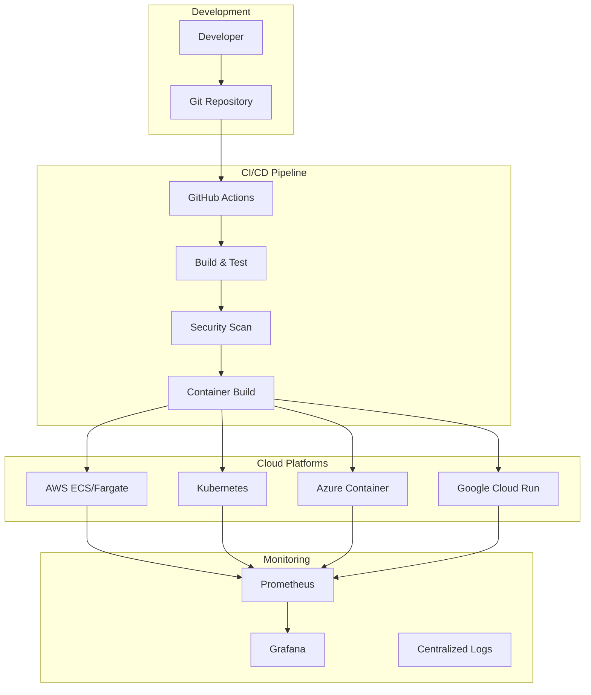

# CI/CD and Cloud Hosting Guide
# Test Execution System

## 🚀 **Complete CI/CD & Cloud Deployment Architecture**

This document provides comprehensive guidance for deploying the Test Execution System across multiple cloud platforms with robust CI/CD pipelines.

## 📋 **Architecture Overview**



## 🔄 **CI/CD Pipeline Features**

### **GitHub Actions Pipeline**
- ✅ **Automated Testing**: Unit tests, integration tests, security scans
- ✅ **Code Quality**: Linting, formatting, security analysis
- ✅ **Multi-Architecture Builds**: AMD64 and ARM64 support
- ✅ **Environment Deployments**: Staging and production pipelines
- ✅ **Performance Testing**: Automated load testing with k6
- ✅ **Security Scanning**: Trivy vulnerability scanning
- ✅ **Infrastructure as Code**: Terraform automation

### **Pipeline Stages**

1. **Code Quality & Testing**
   ```yaml
   - Code formatting (Black)
   - Linting (flake8)
   - Security scanning (Bandit, Safety)
   - Unit tests with coverage
   - Integration tests
   ```

2. **Security & Vulnerability Scanning**
   ```yaml
   - Container vulnerability scanning (Trivy)
   - Dependency scanning
   - SAST (Static Application Security Testing)
   - License compliance
   ```

3. **Build & Package**
   ```yaml
   - Multi-architecture Docker builds
   - Container registry push (GHCR)
   - Artifact generation
   - Version tagging
   ```

4. **Deployment Automation**
   ```yaml
   - Staging deployment (develop branch)
   - Production deployment (releases)
   - Infrastructure provisioning (Terraform)
   - Health checks and validation
   ```

## ☁️ **Cloud Hosting Options**

### **1. Amazon Web Services (AWS)**

#### **Architecture**
- **Compute**: ECS Fargate for serverless containers
- **Database**: RDS PostgreSQL with Multi-AZ
- **Load Balancer**: Application Load Balancer
- **Storage**: S3 for artifacts, EFS for shared storage
- **Networking**: VPC with public/private subnets
- **Monitoring**: CloudWatch, X-Ray tracing

#### **Deployment**
```bash
# Deploy to AWS
./scripts/deploy.sh --platform aws --environment production

# Infrastructure as Code
cd infrastructure/aws
terraform init
terraform plan
terraform apply
```

#### **Costs** (Monthly Estimates)
- **Staging**: ~$150-200/month
- **Production**: ~$300-500/month
- **High Availability**: ~$800-1200/month

#### **Features**
- ✅ Auto-scaling (2-10 instances)
- ✅ High availability across AZs
- ✅ Managed database with backups
- ✅ SSL termination
- ✅ CloudWatch monitoring
- ✅ AWS Security best practices

### **2. Kubernetes (Multi-Cloud)**

#### **Architecture**
- **Deployment**: Kubernetes Deployments with HPA
- **Service Mesh**: Optional Istio integration
- **Storage**: Persistent volumes for data
- **Ingress**: NGINX Ingress Controller
- **Monitoring**: Prometheus + Grafana stack
- **Secrets**: Kubernetes Secrets management

#### **Deployment**
```bash
# Deploy to Kubernetes
./scripts/deploy.sh --platform k8s --environment production

# Apply manifests
kubectl apply -f k8s/
kubectl apply -f monitoring/
```

#### **Supported Platforms**
- **Amazon EKS**: Managed Kubernetes on AWS
- **Google GKE**: Managed Kubernetes on GCP
- **Azure AKS**: Managed Kubernetes on Azure
- **Self-Managed**: On-premises or any cloud

#### **Features**
- ✅ Horizontal Pod Autoscaling
- ✅ Rolling deployments
- ✅ Resource quotas and limits
- ✅ Network policies
- ✅ Persistent storage
- ✅ Service discovery

### **3. Microsoft Azure**

#### **Architecture**
- **Compute**: Azure Container Instances
- **Database**: Azure Database for PostgreSQL
- **Load Balancer**: Azure Load Balancer
- **Storage**: Azure Blob Storage
- **Networking**: Virtual Network
- **Monitoring**: Azure Monitor

#### **Deployment**
```bash
# Deploy to Azure
./scripts/deploy.sh --platform azure --environment production

# Manual deployment
az container create \
  --resource-group test-execution-rg \
  --name test-execution-app \
  --image ghcr.io/yourusername/test-execution-system:latest
```

#### **Features**
- ✅ Serverless containers
- ✅ Integrated monitoring
- ✅ Azure Active Directory integration
- ✅ Virtual network integration
- ✅ Managed database

### **4. Google Cloud Platform (GCP)**

#### **Architecture**
- **Compute**: Cloud Run for serverless containers
- **Database**: Cloud SQL PostgreSQL
- **Load Balancer**: Global Load Balancer
- **Storage**: Cloud Storage
- **Networking**: VPC
- **Monitoring**: Cloud Monitoring

#### **Deployment**
```bash
# Deploy to GCP
./scripts/deploy.sh --platform gcp --environment production

# Manual deployment
gcloud run deploy test-execution-system \
  --image ghcr.io/yourusername/test-execution-system:latest \
  --platform managed
```

#### **Features**
- ✅ Serverless and auto-scaling
- ✅ Global load balancing
- ✅ Integrated CI/CD with Cloud Build
- ✅ IAM and security policies
- ✅ Cloud Monitoring and Logging

## 📊 **Monitoring & Observability**

### **Monitoring Stack**
- **Prometheus**: Metrics collection and storage
- **Grafana**: Visualization and dashboards
- **AlertManager**: Alert routing and management
- **Jaeger**: Distributed tracing (optional)

### **Key Metrics**
- API response times and error rates
- Test execution success/failure rates
- Database connection pool metrics
- Resource utilization (CPU, memory, disk)
- Queue depth and processing times

### **Dashboards**
- **Application Performance**: Request rates, response times, errors
- **Infrastructure Health**: Resource utilization, capacity planning
- **Business Metrics**: Test execution trends, framework usage
- **SLA Monitoring**: Uptime, availability, performance SLAs

### **Alerting Rules**
```yaml
# Critical Alerts
- API downtime > 5 minutes
- Database connection failures
- Disk space < 10%
- Memory usage > 85%

# Warning Alerts
- High response times (p95 > 500ms)
- Test failure rate > 20%
- CPU usage > 80%
```

## 🔧 **Environment Management**

### **Environment Strategy**
1. **Development**: Local Docker Compose
2. **Staging**: Cloud deployment (auto-deploy from develop branch)
3. **Production**: Cloud deployment (manual deploy from releases)

### **Configuration Management**
- **Environment Variables**: Platform-specific configuration
- **Secrets Management**: Database passwords, API keys
- **Feature Flags**: Gradual feature rollouts
- **Database Migrations**: Automated schema updates

### **Branching Strategy**
```
main (production)
  ├── develop (staging)
  │   ├── feature/new-feature
  │   ├── bugfix/issue-123
  │   └── hotfix/critical-fix
  └── release/v1.2.0
```

## 🚀 **Deployment Procedures**

### **Staging Deployment**
```bash
# Automatic on develop branch push
git push origin develop

# Manual staging deployment
./scripts/deploy.sh --environment staging --platform aws
```

### **Production Deployment**
```bash
# Create release
git tag v1.2.0
git push origin v1.2.0

# Manual production deployment
./scripts/deploy.sh --environment production --platform aws
```

### **Rollback Procedures**
```bash
# AWS ECS Rollback
aws ecs update-service --cluster prod-cluster --service api-service --task-definition previous-revision

# Kubernetes Rollback
kubectl rollout undo deployment/test-execution-api -n test-execution

# Docker Compose Rollback
docker-compose down
docker-compose up -d --build
```

## 🛡️ **Security & Compliance**

### **Security Features**
- **Container Scanning**: Vulnerability scanning in CI/CD
- **Secrets Management**: No secrets in code or images
- **Network Security**: Private subnets, security groups
- **SSL/TLS**: End-to-end encryption
- **Authentication**: API key and JWT token support
- **RBAC**: Role-based access control

### **Compliance**
- **Data Protection**: Encryption at rest and in transit
- **Audit Logging**: All actions logged and monitored
- **Backup & Recovery**: Automated database backups
- **Disaster Recovery**: Multi-region deployment capability

## 💰 **Cost Optimization**

### **Cost Management Strategies**

#### **AWS Cost Optimization**
- Use Fargate Spot for non-critical workloads
- Right-size RDS instances based on usage
- Use S3 lifecycle policies for log retention
- Reserved instances for predictable workloads

#### **Kubernetes Cost Optimization**
- Cluster autoscaling for dynamic workloads
- Resource requests and limits optimization
- Spot instances for development/staging
- Horizontal Pod Autoscaling (HPA)

#### **Multi-Cloud Cost Comparison**
| Platform | Staging/Month | Production/Month | HA Production/Month |
|----------|---------------|------------------|---------------------|
| AWS ECS  | $150-200      | $300-500         | $800-1200          |
| Azure    | $120-180      | $250-400         | $600-900           |
| GCP      | $100-150      | $200-350         | $500-800           |
| Kubernetes | $80-120     | $180-300         | $400-700           |

## 📈 **Scaling & Performance**

### **Horizontal Scaling**
- **Auto-scaling**: Based on CPU, memory, and custom metrics
- **Load Balancing**: Distribute traffic across instances
- **Database Scaling**: Read replicas for query performance
- **Caching**: Redis for session and data caching

### **Performance Optimization**
- **Database Indexing**: Optimized queries and indexes
- **Connection Pooling**: Efficient database connections
- **Async Processing**: Background job processing
- **CDN**: Static asset delivery optimization

### **Load Testing**
```bash
# Run performance tests
k6 run tests/performance/load_test.js

# Stress testing
k6 run --vus 500 --duration 10m tests/performance/stress_test.js
```

## 🔄 **Backup & Disaster Recovery**

### **Backup Strategy**
- **Database**: Daily automated backups with 30-day retention
- **Configuration**: Version controlled infrastructure
- **Artifacts**: S3/Blob storage with versioning
- **Logs**: Centralized logging with retention policies

### **Disaster Recovery**
- **RTO**: Recovery Time Objective < 4 hours
- **RPO**: Recovery Point Objective < 1 hour
- **Multi-Region**: Active-passive deployment
- **Data Replication**: Cross-region database replication

## 📝 **Getting Started**

### **Quick Setup**

1. **Prerequisites**
   ```bash
   # Install required tools
   brew install docker kubectl terraform aws-cli
   
   # Or using package manager of choice
   ```

2. **Configuration**
   ```bash
   # Clone repository
   git clone https://github.com/yourusername/test-execution-system
   cd test-execution-system
   
   # Configure environment
   cp .env.example .env
   # Edit .env with your settings
   ```

3. **Local Development**
   ```bash
   # Start local environment
   docker-compose up -d
   
   # Access application
   open http://localhost:8000
   ```

4. **Cloud Deployment**
   ```bash
   # Deploy to your preferred platform
   ./scripts/deploy.sh --platform aws --environment staging
   ```

### **Support & Documentation**

- **API Documentation**: `/docs` endpoint (Swagger UI)
- **Monitoring**: Grafana dashboards
- **Logs**: Centralized logging in cloud platforms
- **Support**: GitHub Issues and Discussions

## 🎯 **Best Practices**

### **Development**
- Follow GitFlow branching strategy
- Write comprehensive tests
- Use feature flags for gradual rollouts
- Implement proper logging and monitoring

### **Deployment**
- Use Infrastructure as Code (Terraform)
- Implement blue-green deployments
- Automate rollback procedures
- Monitor deployment health

### **Operations**
- Set up proper alerting and monitoring
- Implement automated backup verification
- Regular security updates and patching
- Capacity planning and scaling

---

## 🏆 **Production-Ready Features**

✅ **Multi-cloud deployment support**
✅ **Automated CI/CD pipelines**
✅ **Comprehensive monitoring and alerting**
✅ **Security scanning and compliance**
✅ **Auto-scaling and load balancing**
✅ **Backup and disaster recovery**
✅ **Performance testing and optimization**
✅ **Cost optimization strategies**
✅ **Infrastructure as Code**
✅ **Zero-downtime deployments**

This architecture provides enterprise-grade reliability, scalability, and maintainability for the Test Execution System across any cloud platform. 