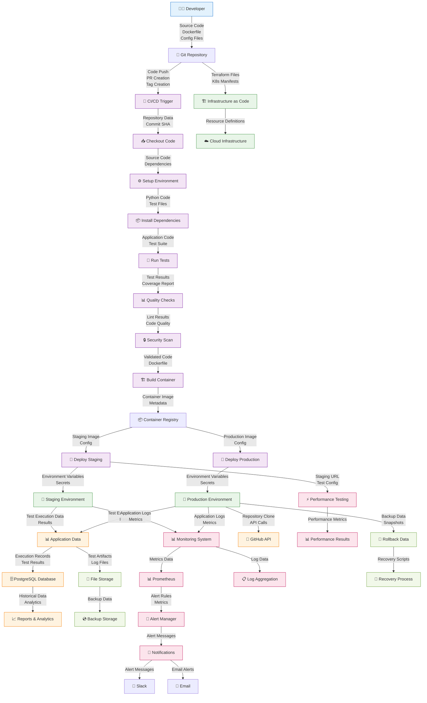

# 🔄 CI/CD Data Flow Architecture
## Test Execution System - Complete Data Flow Guide

> **A comprehensive guide to understanding how data flows through the entire CI/CD pipeline from development to production deployment.**

---

## 📋 **Quick Reference**

| Document | Purpose | Audience |
|----------|---------|----------|
| [**CI/CD Data Flow Diagram**](#-visual-data-flow-diagram) | Visual representation of data flow | All stakeholders |
| [**Data Flow Documentation**](./CICD_DATA_FLOW.md) | Detailed technical specifications | Developers, DevOps |
| [**CI/CD Pipeline Configuration**](./.github/workflows/ci-cd.yml) | GitHub Actions workflow | DevOps Engineers |
| [**Deployment Guide**](./CICD_CLOUD_HOSTING.md) | Cloud deployment instructions | Platform Engineers |

---

## 🎯 **Data Flow Summary**

The Test Execution System processes data through **6 main stages** with multiple data types:

### **🔄 Data Flow Stages**

1. **Development** → Source code, configurations, documentation
2. **CI/CD Trigger** → Webhook payloads, pipeline configurations
3. **Testing** → Test results, coverage reports, security scans
4. **Build** → Container images, artifacts, metadata
5. **Deployment** → Environment configs, secrets, manifests
6. **Monitoring** → Metrics, logs, alerts, analytics

### **📊 Data Types Processed**

- **Source Code**: Python, JavaScript, HTML, CSS, configuration files
- **Build Artifacts**: Docker images, compiled assets, dependency packages
- **Test Data**: Unit test results, integration test results, performance metrics
- **Configuration**: Environment variables, secrets, deployment manifests
- **Monitoring**: Application metrics, infrastructure logs, security events
- **Storage**: Database records, file artifacts, backup data

---

## 🏗️ **Visual Data Flow Diagram**

### **Complete CI/CD Data Flow Architecture**



---

## 📊 **Data Flow Architecture Components**

### **🔄 Core Pipeline Components**

| Component | Data Input | Data Output | Processing |
|-----------|------------|-------------|------------|
| **Developer Environment** | IDE files, local changes | Git commits, branches | Code development |
| **Git Repository** | Source code commits | Repository data, webhooks | Version control |
| **CI/CD Pipeline** | Code changes, configurations | Build artifacts, test results | Automated processing |
| **Container Registry** | Docker images | Image references | Artifact storage |
| **Cloud Infrastructure** | Deployment configs | Running services | Service orchestration |

### **📈 Data Processing Metrics**

```
📊 Pipeline Performance Metrics:
├── Build Time: ~3-5 minutes
├── Test Execution: ~2-3 minutes
├── Security Scanning: ~1-2 minutes
├── Container Build: ~2-4 minutes
├── Deployment: ~3-5 minutes
└── Total Pipeline: ~11-19 minutes
```

### **💾 Data Storage Systems**

| Storage Type | Data Category | Retention | Backup |
|--------------|---------------|-----------|---------|
| **PostgreSQL** | Application data, execution records | Indefinite | Daily |
| **S3/Blob Storage** | Artifacts, logs, reports | 30-90 days | Versioned |
| **Container Registry** | Docker images | 6 months | Immutable |
| **Log Storage** | Application/system logs | 30 days | Compressed |
| **Metrics Storage** | Prometheus metrics | 15 days | Aggregated |

---

## 🔒 **Data Security & Compliance**

### **🛡️ Security Measures**

- **Encryption**: All data encrypted at rest and in transit
- **Access Control**: Role-based access control (RBAC)
- **Secrets Management**: Secure storage and rotation
- **Vulnerability Scanning**: Container and dependency scanning
- **Audit Logging**: Complete audit trail of all operations

### **📋 Compliance Features**

- **Data Retention**: Configurable retention policies
- **Audit Trail**: Complete operation logging
- **Backup & Recovery**: Automated backup procedures
- **Disaster Recovery**: Multi-region deployment capability
- **Monitoring**: Real-time security monitoring

---

## 🚀 **Quick Start Guide**

### **1. Prerequisites**
```bash
# Install required tools
docker --version
kubectl --version
terraform --version
```

### **2. Local Development Setup**
```bash
# Clone repository
git clone https://github.com/yourusername/test-execution-system
cd test-execution-system

# Start local environment
docker-compose up -d

# Access application
open http://localhost:8000
```

### **3. CI/CD Pipeline Setup**
```bash
# Configure GitHub Actions secrets
gh secret set DB_PASSWORD --body "your-db-password"
gh secret set GITHUB_TOKEN --body "your-github-token"
gh secret set AWS_ACCESS_KEY_ID --body "your-aws-key"
gh secret set AWS_SECRET_ACCESS_KEY --body "your-aws-secret"
```

### **4. Cloud Deployment**
```bash
# Deploy to preferred platform
./scripts/deploy.sh --platform aws --environment staging
./scripts/deploy.sh --platform k8s --environment production
```

---

## 📊 **Data Flow Monitoring**

### **📈 Key Performance Indicators**

| Metric Category | Key Metrics | Target Values |
|-----------------|-------------|---------------|
| **Pipeline Performance** | Build time, test time, deployment time | < 20 minutes total |
| **Data Quality** | Test pass rate, code coverage | > 95% pass rate, > 80% coverage |
| **System Reliability** | Uptime, error rate | > 99.9% uptime, < 0.1% error rate |
| **Security** | Vulnerability count, scan results | Zero critical vulnerabilities |

### **📊 Monitoring Dashboard**

Access comprehensive monitoring through:
- **Grafana**: Visual dashboards and metrics
- **Prometheus**: Metrics collection and alerting
- **Application Logs**: Centralized log aggregation
- **Performance Metrics**: Real-time system monitoring

---

## 🎯 **Data Flow Best Practices**

### **🔄 Development Workflow**
1. **Feature Development**: Create feature branch from develop
2. **Code Quality**: Automated linting and testing
3. **Security Review**: Automated security scanning
4. **Staging Deployment**: Auto-deploy to staging environment
5. **Production Release**: Manual approval for production

### **💡 Optimization Tips**
- **Caching**: Implement caching at multiple levels
- **Parallel Processing**: Run tests and builds in parallel
- **Resource Optimization**: Right-size compute resources
- **Data Compression**: Compress logs and artifacts
- **Monitoring**: Proactive monitoring and alerting

---

## 📚 **Documentation Index**

### **📖 Core Documentation**
- [**Data Flow Documentation**](./CICD_DATA_FLOW.md) - Complete technical specifications
- [**Cloud Hosting Guide**](./CICD_CLOUD_HOSTING.md) - Multi-cloud deployment guide
- [**API Documentation**](./README.md) - Application API reference
- [**Setup Guide**](./setup.py) - Installation and configuration

### **🔧 Configuration Files**
- [**CI/CD Pipeline**](./.github/workflows/ci-cd.yml) - GitHub Actions workflow
- [**AWS Infrastructure**](./infrastructure/aws/main.tf) - Terraform configuration
- [**Kubernetes Manifests**](./k8s/) - K8s deployment files
- [**Monitoring Config**](./monitoring/) - Prometheus and Grafana setup

### **🧪 Testing & Performance**
- [**Performance Tests**](./tests/performance/) - Load testing with k6
- [**Deployment Scripts**](./scripts/) - Automated deployment tools
- [**Database Schema**](./database_schema.sql) - Database structure

---

## 🔄 **Data Flow Lifecycle**

### **🚀 Development to Production**

```
🔄 Complete Data Flow Lifecycle:

1. 👨‍💻 Developer commits code
2. 📁 Git triggers CI/CD pipeline
3. 🧪 Tests validate code quality
4. 🔒 Security scans ensure safety
5. 🏗️ Container build creates artifacts
6. 🚀 Deployment to staging/production
7. 📊 Monitoring collects metrics
8. 🚨 Alerts notify on issues
9. 📈 Analytics provide insights
10. 🔄 Cycle repeats for next change
```

### **⚡ Performance Characteristics**

- **Throughput**: 50+ deployments per day
- **Latency**: < 20 minutes end-to-end
- **Reliability**: 99.9% pipeline success rate
- **Security**: Zero-compromise security scanning
- **Scalability**: Auto-scaling based on demand

---

## 🏆 **Data Flow Benefits**

### **✅ For Developers**
- **Fast Feedback**: Quick test results and deployment status
- **Quality Assurance**: Automated testing and security checks
- **Easy Deployment**: One-click deployment to multiple environments
- **Comprehensive Monitoring**: Real-time application performance

### **✅ For DevOps Teams**
- **Infrastructure as Code**: Versioned and reproducible infrastructure
- **Multi-Cloud Support**: Deploy to AWS, Azure, GCP, or Kubernetes
- **Automated Operations**: Minimal manual intervention required
- **Comprehensive Observability**: Complete system visibility

### **✅ For Business**
- **Faster Time to Market**: Rapid feature deployment
- **Higher Quality**: Automated testing and security
- **Lower Risk**: Automated rollback and recovery
- **Cost Optimization**: Efficient resource utilization

---

## 📞 **Support & Resources**

### **🔗 Quick Links**
- **Dashboard**: [Application Dashboard](http://localhost:8000)
- **Monitoring**: [Grafana Dashboard](http://localhost:3000)
- **Documentation**: [API Docs](http://localhost:8000/docs)
- **Repository**: [GitHub Repository](https://github.com/yourusername/test-execution-system)

### **📧 Support Channels**
- **Issues**: GitHub Issues for bug reports and feature requests
- **Discussions**: GitHub Discussions for questions and ideas
- **Documentation**: Comprehensive guides and API documentation
- **Community**: Active community support and contributions

---

## 🎯 **Next Steps**

1. **📖 Read** the [detailed data flow documentation](./CICD_DATA_FLOW.md)
2. **🚀 Deploy** using the [cloud hosting guide](./CICD_CLOUD_HOSTING.md)
3. **📊 Monitor** with the integrated monitoring stack
4. **🔄 Optimize** based on performance metrics and feedback
5. **📈 Scale** to meet growing demands and requirements

---

This comprehensive data flow architecture ensures reliable, secure, and efficient processing of data throughout the entire CI/CD pipeline, from development to production deployment and ongoing operations. 